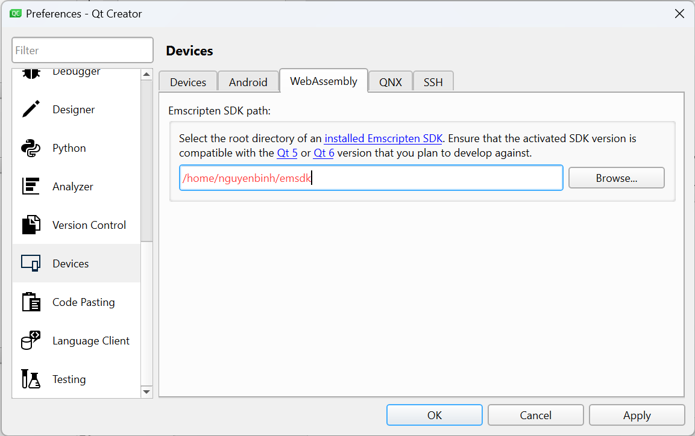
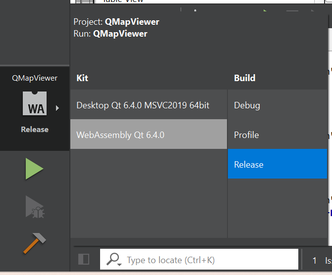

# Deploy WebASM
Guide for deploying WebASM (Qt 6.4)

## Setup emscripten
```sh
cd $HOME
git clone https://github.com/emscripten-core/emsdk.git
cd emsdk
./emsdk install 3.1.14
./emsdk activate 3.1.14
```

## Setup Qt
Open `Edit` -> `Preferences...`. On left side, choose `Devices` and enter path to emscripten above (In this case `$HOME/emsdk`)



## Build Qt
Select Release build and build project.



Copy those files to server (`$HOME/app/html` on server):
```
object_script.QMapViewer.js
QMapViewer.html
QMapViewer.js
QMapViewer.wasm
qtloader.js
qtlogo.svg
```

## Setup nginx
Setup nginx on server.
```
sudo apt update
sudo apt install nginx
```

## Create config file
Create this file `/home/azureuser/app/nginx/default`:
```conf
##
# You should look at the following URL's in order to grasp a solid understanding
# of Nginx configuration files in order to fully unleash the power of Nginx.
# https://www.nginx.com/resources/wiki/start/
# https://www.nginx.com/resources/wiki/start/topics/tutorials/config_pitfalls/
# https://wiki.debian.org/Nginx/DirectoryStructure
#
# In most cases, administrators will remove this file from sites-enabled/ and
# leave it as reference inside of sites-available where it will continue to be
# updated by the nginx packaging team.
#
# This file will automatically load configuration files provided by other
# applications, such as Drupal or Wordpress. These applications will be made
# available underneath a path with that package name, such as /drupal8.
#
# Please see /usr/share/doc/nginx-doc/examples/ for more detailed examples.
##

# Default server configuration
#
server {
	listen 80 default_server;
	listen [::]:80 default_server;

	# SSL configuration
	#
	# listen 443 ssl default_server;
	# listen [::]:443 ssl default_server;
	#
	# Note: You should disable gzip for SSL traffic.
	# See: https://bugs.debian.org/773332
	#
	# Read up on ssl_ciphers to ensure a secure configuration.
	# See: https://bugs.debian.org/765782
	#
	# Self signed certs generated by the ssl-cert package
	# Don't use them in a production server!
	#
	# include snippets/snakeoil.conf;

	root /home/azureuser/app/html;

	# Add index.php to the list if you are using PHP
	index index.html index.htm index.nginx-debian.html;

	server_name _;

	location / {
		# First attempt to serve request as file, then
		# as directory, then fall back to displaying a 404.
		try_files $uri $uri/ =404;
	}

	# pass PHP scripts to FastCGI server
	#
	#location ~ \.php$ {
	#	include snippets/fastcgi-php.conf;
	#
	#	# With php-fpm (or other unix sockets):
	#	fastcgi_pass unix:/var/run/php/php7.4-fpm.sock;
	#	# With php-cgi (or other tcp sockets):
	#	fastcgi_pass 127.0.0.1:9000;
	#}

	# deny access to .htaccess files, if Apache's document root
	# concurs with nginx's one
	#
	#location ~ /\.ht {
	#	deny all;
	#}
}


# Virtual Host configuration for example.com
#
# You can move that to a different file under sites-available/ and symlink that
# to sites-enabled/ to enable it.
#
#server {
#	listen 80;
#	listen [::]:80;
#
#	server_name example.com;
#
#	root /var/www/example.com;
#	index index.html;
#
#	location / {
#		try_files $uri $uri/ =404;
#	}
#}
```

Replace the current one:
```sh
sudo rm /etc/nginx/sites-enabled
sudo ln -s /home/azureuser/app/nginx/default /etc/nginx/sites-enabled
```

## Restart nginx
```
sudo systemctl restart nginx
```